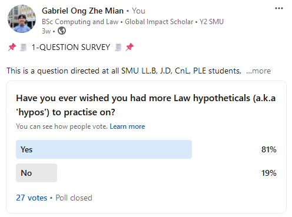

[](https://github.com/gongahkia/jikai/releases/tag/1.0) [](https://github.com/gongahkia/jikai/releases/tag/2.0)

> [!IMPORTANT]  
> Please read through [this disclaimer](#disclaimer) before using [Jikai](https://github.com/gongahkia/jikai).  

# `Jikai` 🧲

Create, share and review law hypotheticals.

## Rationale

Over the finals season in December 2024, I found myself wishing I had more tort law [hypotheticals](https://successatmls.com/hypos/) to practise on aside from those [my professor](https://www.linkedin.com/in/jerroldsoh/?originalSubdomain=sg) had provided.  
  
A [quick google search](https://www.reddit.com/r/LawSchool/comments/16istgs/where_to_find_hypos/) revealed this sentiment was shared by many studying law, even [outside of Singapore](https://www.reddit.com/r/findareddit/comments/ssr9wk/a_community_for_hypothetical_legal_questions/). Conducting a [Linkedin poll](https://www.linkedin.com/posts/gabriel-zmong_smu-law-linkedin-activity-7269531363463049217-DXUm?utm_source=share&utm_medium=member_desktop) confirmed these results.



With these considerations in mind, I created Jikai.

Jikai is a unified website-as-a-platform for *law [students](https://www.goodreads.com/quotes/3206899-a-man-cannot-understand-the-art-he-is-studying-if)* to generate, practise and contribute law hypotheticals.

Current applications are focused on [Singapore Tort Law](https://www.sal.org.sg/Resources-Tools/Publications/Overview/PublicationsDetails/id/183) but [other domains of law](https://lawforcomputerscientists.pubpub.org/pub/d3mzwako/release/7) can be easily swapped in.

> [!TIP]  
> More domains of law might be added in the future. Open an issue to contribute suggestions!  

## Usage

There are currently two ways to use Jikai.

1. [Access the webapp](#app)
2. [Build it yourself](#build)

### App

> TODO add more details here upon deployment

Use the Jikai webapp here.

### Build Jikai

#### Build from source

```console
$ git clone https://github.com/gongahkia/jikai
$ make config
$ cd ./src
$ python3 main.py
```

#### Build a Docker image

```console
$ git clone https://github.com/gongahkia/jikai
$ docker build -t jikai ./jikai
$ docker run jikai
```

## Architecture


## Disclaimer

All hypotheticals generated with [Jikai](https://github.com/gongahkia/jikai) are intended for educational and informational purposes only. They do not constitute legal advice and should not be relied upon as such. 

### No Liability

By using this tool, you acknowledge and agree that:

1. The creator of this tool shall not be liable for any direct, indirect, incidental, consequential, or special damages arising out of or in connection with the use of the hypotheticals generated, including but not limited to any claims related to defamation or other torts.
2. Any reliance on the information provided by this tool is at your own risk. The creators make no representations or warranties regarding the accuracy, reliability, or completeness of any content generated.
3. The content produced may not reflect current legal standards or interpretations and should not be used as a substitute for professional legal advice.
4. You are encouraged to consult with a qualified legal professional regarding any specific legal questions or concerns you may have. Use of this tool signifies your acceptance of these terms.

## References

The name `Jikai` is in reference to the sorcery of [Ikuto Hagiwara](https://kagurabachi.fandom.com/wiki/Ikuto_Hagiwara) (萩原 幾兎), the commander of the [Kamunabi's](https://kagurabachi.fandom.com/wiki/Kamunabi) [anti-cloud gouger special forces](https://kagurabachi.fandom.com/wiki/Kamunabi#Anti-Cloud_Gouger_Special_Forces), who opposed [Genichi Sojo](https://kagurabachi.fandom.com/wiki/Genichi_Sojo) in the [Vs. Sojo arc](https://kagurabachi.fandom.com/wiki/Vs._Sojo_Arc) of the manga series [Kagurabachi](https://kagurabachi.fandom.com/wiki/Kagurabachi_Wiki).


## Research

Jikai would not be where it was today without existing academia.  

* [*Focused and Fun: A How-to Guide for
Creating Hypotheticals for Law
Students*](https://scribes.org/wp-content/uploads/2022/10/Simon-8.23.21.pdf) by Diana J. Simon
* [*Reactive Hypotheticals in Legal Education: Leveraging AI to Create Interactive Fact Patterns*](https://papers.ssrn.com/sol3/papers.cfm?abstract_id=4763738) by Sean Steward
* [*Legal Theory Lexicon: Hypotheticals*](https://lsolum.typepad.com/legaltheory/2023/01/legal-theory-lexicon-hypotheticals.html) by Legal Theory Blog
