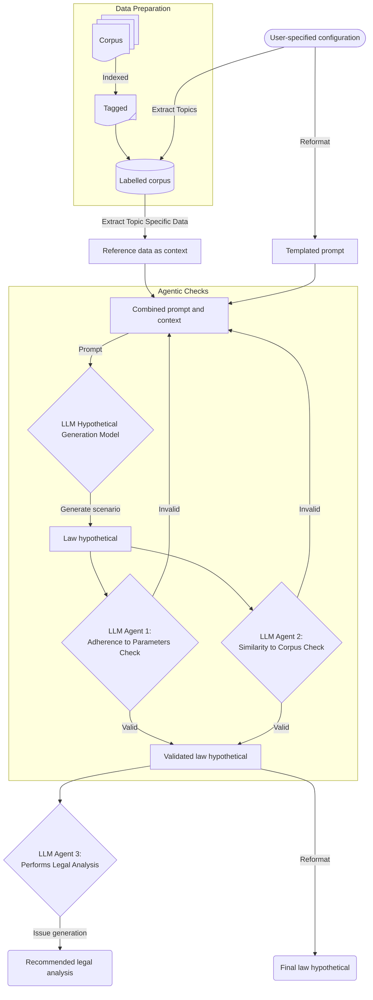

[](https://github.com/gongahkia/jikai/releases/tag/1.0)

# `Jikai`

Create law hypos.

## Usage

Build the local docker image.

```console
$ docker build -t jikai
$ docker run jikai
```

## Architecture



## References

The name `Jikai` is in reference to the sorcery of [Ikuto Hagiwara](https://kagurabachi.fandom.com/wiki/Ikuto_Hagiwara) (萩原 幾兎), the commander of the [Kamunabi's](https://kagurabachi.fandom.com/wiki/Kamunabi) [anti-cloud gouger special forces](https://kagurabachi.fandom.com/wiki/Kamunabi#Anti-Cloud_Gouger_Special_Forces), who opposed [Genichi Sojo](https://kagurabachi.fandom.com/wiki/Genichi_Sojo) in the [Vs. Sojo arc](https://kagurabachi.fandom.com/wiki/Vs._Sojo_Arc) of the manga series [Kagurabachi](https://kagurabachi.fandom.com/wiki/Kagurabachi_Wiki).


