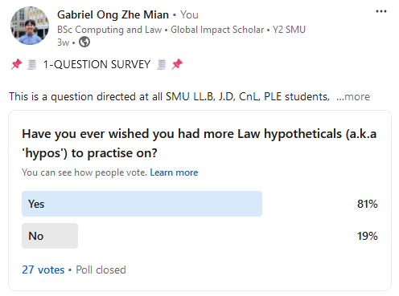
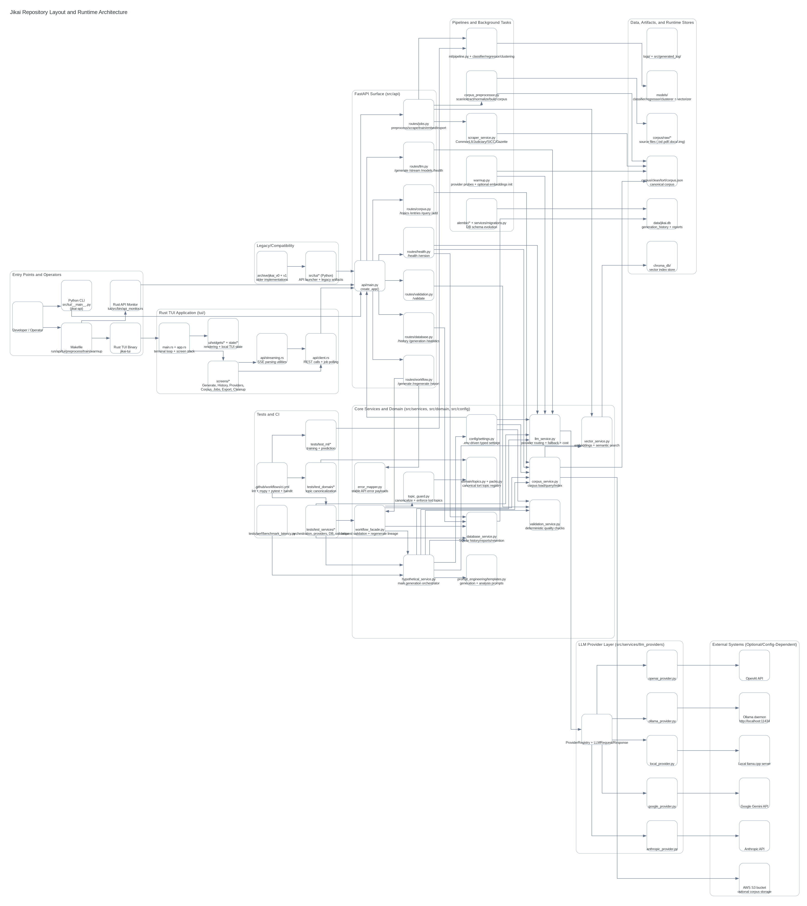

[](https://github.com/gongahkia/jikai/releases/tag/1.0.0)
[](https://github.com/gongahkia/jikai/releases/tag/2.0.0)


> [!IMPORTANT]
> Please read through [this disclaimer](#disclaimer) before using [Jikai](https://github.com/gongahkia/jikai).

# `Jikai`

AI-Powered Legal Hypothetical Generator for [Singapore Tort Law](https://www.advlawllc.com/practice/tort-law/#:~:text=Tort%20law%20deals%20with%20civil,defamation%2C%20trespass%2C%20and%20nuisance.).

## Rationale

Over the finals season in December 2024, I found myself wishing I had more tort law [hypotheticals](https://successatmls.com/hypos/) to practise on aside from those [my professor](https://www.linkedin.com/in/jerroldsoh/?originalSubdomain=sg) had provided.

A [quick google search](https://www.reddit.com/r/LawSchool/comments/16istgs/where_to_find_hypos/) revealed this sentiment was shared by many studying law, even [outside of Singapore](https://www.reddit.com/r/findareddit/comments/ssr9wk/a_community_for_hypothetical_legal_questions/). Conducting a [Linkedin poll](https://www.linkedin.com/posts/gabriel-zmong_smu-law-linkedin-activity-7269531363463049217-DXUm?utm_source=share&utm_medium=member_desktop) confirmed these results.

<div align="center">
    <br>
    
    <br><br>
</div>

With these considerations in mind, I created `Jikai`.

`Jikai` generates legal hypotheticals for Singapore Tort Law with a [multi-provider LLM backend](#architecture), [semantic corpus retrieval](#architecture), and an [ML-assisted validation pipeline](#architecture), served through a [TUI](#stack) or [FastAPI Rest API](#stack).

It is mainly served as a legal education tool.

## Stack

* *Backend*: [Python](https://www.python.org/), [FastAPI](https://fastapi.tiangolo.com/), [Uvicorn](https://www.uvicorn.org/), [Pydantic](https://docs.pydantic.dev/)
* *TUI*: [Rich](https://rich.readthedocs.io/), [questionary](https://questionary.readthedocs.io/), [prompt_toolkit](https://python-prompt-toolkit.readthedocs.io/)
* *LLM Providers*: [Ollama](https://ollama.ai/), [Anthropic](https://www.anthropic.com/), [Google Gemini](https://ai.google.dev/), [OpenAI](https://openai.com/)
* *AI/ML*: [scikit-learn](https://scikit-learn.org/), [PyTorch](https://pytorch.org/), [Transformers](https://huggingface.co/docs/transformers/)
* *Embeddings*: [Sentence Transformers](https://www.sbert.net/), [ChromaDB](https://www.trychroma.com/)
* *Storage*: [SQLite](https://www.sqlite.org/), [ChromaDB](https://www.trychroma.com/), [AWS S3](https://aws.amazon.com/s3/) via [boto3](https://boto3.amazonaws.com/v1/documentation/api/latest/index.html)
* *OCR & Preprocessing*: [PyMuPDF](https://pymupdf.readthedocs.io/), [python-docx](https://python-docx.readthedocs.io/), [Pillow](https://pillow.readthedocs.io/), [pytesseract](https://pypi.org/project/pytesseract/)
* *Scraping*: [BeautifulSoup4](https://www.crummy.com/software/BeautifulSoup/), [lxml](https://lxml.de/), [httpx](https://www.python-httpx.org/)
* *Monitoring*: [structlog](https://www.structlog.org/), [Prometheus](https://prometheus.io/), [Sentry](https://sentry.io/)
* *Testing*: [pytest](https://pytest.org/), [pytest-asyncio](https://pytest-asyncio.readthedocs.io/), [pytest-cov](https://pytest-cov.readthedocs.io/)

## Usage

The below instructions are for locally running `Jikai`.

1. Create `.env` off of `env.example` and fill your API keys and configuration.
q
```console
$ make env-setup
```

2. Next, run the below commands to install all dependencies and kickstart local services.

```console
$ make install
$ ollama serve
$ ollama pull llama3
```

3. Then run the below commands to interact with `Jikai`.

```console
$ make run # runs the API server and TUI
$ make tui # runs only the TUI
$ make api # runs only the API
$ make preprocess # preprocess raw corpus files
$ make train # train on processed corpus
```

## API

> [!NOTE]
All endpoints except `/`, `/health`, `/docs`, `/redoc`, and `/openapi.json` require the `X-API-Key` header when `JIKAI_API_KEY` is set. Requests are rate-limited to 100 per 60 seconds per client IP.

`Jikai`'s REST API is served at `http://localhost:8000`. Alternatively, find the interactive docs at `/docs` when `API_DEBUG=true`.

| Method | Endpoint | Description |
|--------|----------|-------------|
| `GET` | `/` | Service info |
| `GET` | `/health` | Health check across all services |
| `POST` | `/generate` | Generate a single legal hypothetical |
| `POST` | `/generate/batch` | Generate up to 10 hypotheticals in one request |
| `GET` | `/topics` | List all available tort law topics from the corpus |
| `GET` | `/corpus/entries` | Fetch corpus entries with optional topic filtering |
| `POST` | `/corpus/entries` | Add a new entry to the corpus |
| `GET` | `/llm/models` | List available models per provider |
| `GET` | `/llm/health` | Check LLM provider health |
| `GET` | `/providers` | List all providers and their model availability |
| `PUT` | `/providers/default` | Set the default LLM provider and model |
| `GET` | `/stats` | Generation statistics from the SQLite database |
| `POST` | `/ml/train` | Trigger ML pipeline training |
| `GET` | `/ml/status` | Get trained model status and metrics |
| `GET` | `/export/{history_id}` | Export a past generation as DOCX or PDF |

## Architecture



## Disclaimer

All hypotheticals generated with [`Jikai`](https://github.com/gongahkia/jikai) are intended for educational and informational purposes only. They do not constitute legal advice and should not be relied upon as such.

### No Liability

By using this tool, you acknowledge and agree that:

1. The creator of this tool shall not be liable for any direct, indirect, incidental, consequential, or special damages arising out of or in connection with the use of the hypotheticals generated, including but not limited to any claims related to defamation or other torts.
2. Any reliance on the information provided by this tool is at your own risk. The creators make no representations or warranties regarding the accuracy, reliability, or completeness of any content generated.
3. The content produced may not reflect current legal standards or interpretations and should not be used as a substitute for professional legal advice.
4. You are encouraged to consult with a qualified legal professional regarding any specific legal questions or concerns you may have. Use of this tool signifies your acceptance of these terms.

## References

The name `Jikai` is in reference to the sorcery of [Ikuto Hagiwara](https://kagurabachi.fandom.com/wiki/Ikuto_Hagiwara) (萩原 幾兎), the commander of the [Kamunabi's](https://kagurabachi.fandom.com/wiki/Kamunabi) [anti-cloud gouger special forces](https://kagurabachi.fandom.com/wiki/Kamunabi#Anti-Cloud_Gouger_Special_Forces), who opposed [Genichi Sojo](https://kagurabachi.fandom.com/wiki/Genichi_Sojo) in the [Vs. Sojo arc](https://kagurabachi.fandom.com/wiki/Vs._Sojo_Arc) of the manga series [Kagurabachi](https://kagurabachi.fandom.com/wiki/Kagurabachi_Wiki).

<div align="center">
  
</div>

## Research

`Jikai` would not be where it was today without existing academia.

* [*Focused and Fun: A How-to Guide for Creating Hypotheticals for Law Students*](https://scribes.org/wp-content/uploads/2022/10/Simon-8.23.21.pdf) by Diana J. Simon
* [*Reactive Hypotheticals in Legal Education: Leveraging AI to Create Interactive Fact Patterns*](https://papers.ssrn.com/sol3/papers.cfm?abstract_id=4763738) by Sean Steward
* [*Legal Theory Lexicon: Hypotheticals*](https://lsolum.typepad.com/legaltheory/2023/01/legal-theory-lexicon-hypotheticals.html) by Legal Theory Blog
* [*The Case Method*](https://jle.aals.org/cgi/viewcontent.cgi?article=1920&context=home) by E.M. Morgan
* [*A Process Model of Legal Argument with Hypotheticals*](https://publications.informatik.hu-berlin.de/archive/cses/publications/a_process_model_of_legal_argument_with_hypotheticals.pdf) by Kevin Ashley, Collin Lynchb, Niels Pinkwartc, Vincent Alevend
* [*The Case Study Teaching Method*](https://casestudies.law.harvard.edu/the-case-study-teaching-method/) by Havard Law School
