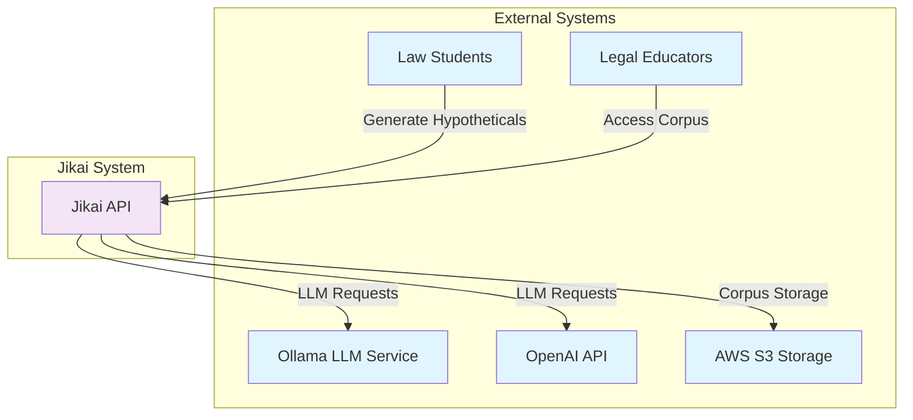
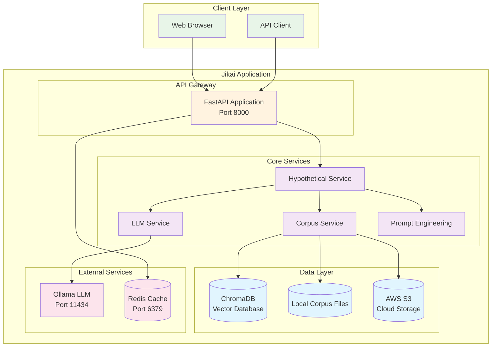
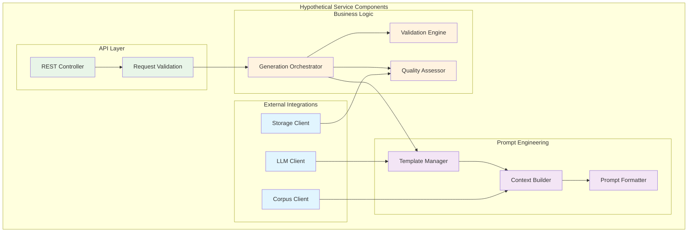
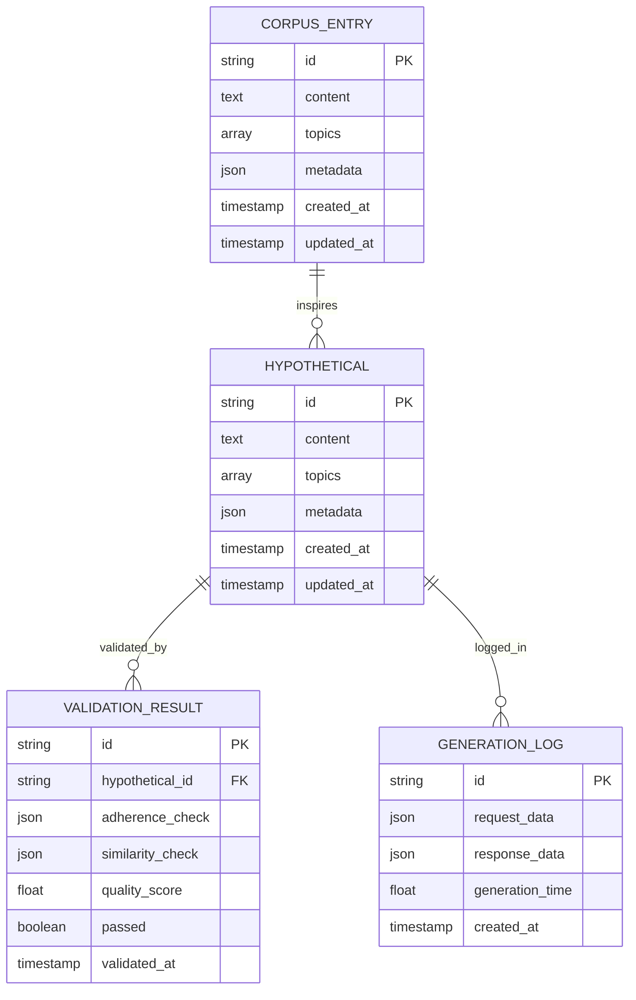
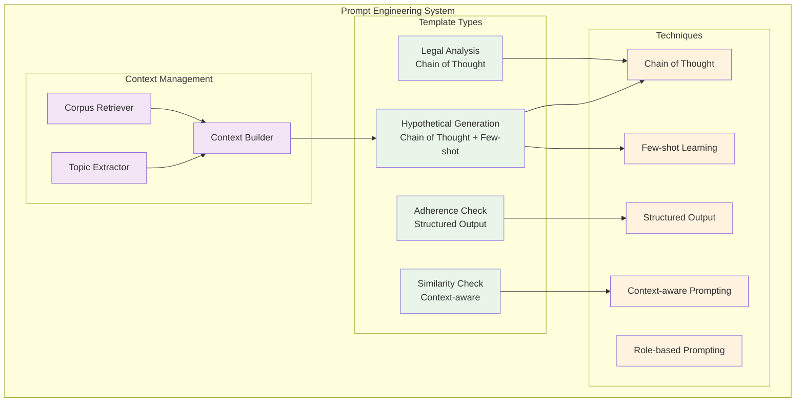

[](https://github.com/gongahkia/jikai/releases/tag/2.0.0) 
[](https://www.docker.com/)
[](https://fastapi.tiangolo.com/)
[](https://www.python.org/)
[](https://opensource.org/licenses/MIT)

> [!IMPORTANT]  
> Please read through [this disclaimer](#disclaimer) before using [Jikai](https://github.com/gongahkia/jikai).  

# `Jikai` 🧲

**AI-Powered Legal Hypothetical Generator for Singapore Tort Law**

*Practice makes permanent.*

## Overview

Jikai is a production-ready, microservices-based application that generates high-quality legal hypotheticals for Singapore Tort Law education. Built with modern software engineering practices, it features advanced prompt engineering, comprehensive validation, and scalable architecture.

### Key Features

- 🎯 **Advanced Prompt Engineering**: Multiple templates with Chain of Thought, Few-shot Learning, and Role-based prompting
- 🏗️ **Microservices Architecture**: Modular design with separate services for LLM, corpus management, and hypothetical generation
- 🚀 **FastAPI REST API**: High-performance async API with automatic documentation
- 🐳 **Production-Ready Docker**: Multi-stage builds with security best practices
- 📊 **Comprehensive Validation**: Multi-agent validation system for quality assurance
- 🔍 **Vector Search**: ChromaDB integration for intelligent corpus retrieval
- ☁️ **Cloud Integration**: AWS S3 support for scalable corpus storage
- 📈 **Monitoring & Observability**: Health checks, metrics, and structured logging
- 🧪 **Comprehensive Testing**: Unit tests, integration tests, and test coverage

## Quick Start

### Using Docker Compose (Recommended)

```bash
# Clone the repository
git clone https://github.com/gongahkia/jikai
cd jikai

# Copy environment configuration
cp env.example .env

# Start all services
docker-compose up -d

# Check service health
curl http://localhost:8000/health
```

### Local Development

```bash
# Install dependencies
pip install -r requirements.txt

# Set up environment
cp env.example .env
# Edit .env with your configuration

# Start Ollama (required for LLM)
docker run -d -p 11434:11434 ollama/ollama

# Pull the model
docker exec -it <ollama-container> ollama pull llama2:7b

# Start the API
uvicorn src.api.main:app --reload --host 0.0.0.0 --port 8000
```

### API Usage

```bash
# Generate a hypothetical
curl -X POST "http://localhost:8000/generate" \
  -H "Content-Type: application/json" \
  -d '{
    "topics": ["negligence", "duty of care"],
    "number_parties": 3,
    "complexity_level": "intermediate"
  }'

# Get available topics
curl http://localhost:8000/topics

# Check service health
curl http://localhost:8000/health
```

## Architecture

### C4 Model - System Context



### C4 Model - Container Diagram



### C4 Model - Component Diagram (Hypothetical Service)



### Database Schema



### Prompt Engineering Architecture



## API Documentation

### Core Endpoints

| Endpoint | Method | Description |
|----------|--------|-------------|
| `/generate` | POST | Generate a legal hypothetical |
| `/topics` | GET | Get available legal topics |
| `/corpus/entries` | GET | Retrieve corpus entries |
| `/corpus/entries` | POST | Add new corpus entry |
| `/health` | GET | Service health check |
| `/stats` | GET | Generation statistics |
| `/llm/models` | GET | Available LLM models |
| `/llm/health` | GET | LLM service health |

### Request/Response Examples

#### Generate Hypothetical

**Request:**
```json
{
  "topics": ["negligence", "duty of care", "causation"],
  "law_domain": "tort",
  "number_parties": 3,
  "complexity_level": "intermediate",
  "sample_size": 2
}
```

**Response:**
```json
{
  "hypothetical": "Detailed legal scenario...",
  "analysis": "Comprehensive legal analysis...",
  "metadata": {
    "topics": ["negligence", "duty of care", "causation"],
    "generation_time": 15.2,
    "validation_passed": true
  },
  "validation_results": {
    "adherence_check": {...},
    "similarity_check": {...},
    "quality_score": 8.5,
    "passed": true
  }
}
```

## Development

### Project Structure

```
jikai/
├── src/
│   ├── api/                 # FastAPI application
│   ├── config/              # Configuration management
│   ├── services/            # Core business services
│   │   ├── llm_service.py   # LLM integration
│   │   ├── corpus_service.py # Corpus management
│   │   ├── hypothetical_service.py # Main orchestration
│   │   └── prompt_engineering/ # Prompt templates
│   └── main.py             # Legacy entry point
├── tests/                   # Test suite
├── corpus/                  # Legal corpus data
├── docker-compose.yml       # Production deployment
├── docker-compose.dev.yml   # Development deployment
├── Dockerfile              # Multi-stage container build
└── requirements.txt        # Python dependencies
```

### Running Tests

```bash
# Install test dependencies
pip install -r requirements.txt

# Run all tests
pytest

# Run with coverage
pytest --cov=src --cov-report=html

# Run specific test file
pytest tests/test_services/test_llm_service.py
```

### Code Quality

```bash
# Format code
black src/ tests/
isort src/ tests/

# Lint code
flake8 src/ tests/
mypy src/

# Run pre-commit hooks
pre-commit run --all-files
```

### Environment Configuration

Copy `env.example` to `.env` and configure:

```bash
# Core settings
ENVIRONMENT=development
API_DEBUG=true
LOG_LEVEL=DEBUG

# LLM configuration
LLM_PROVIDER=ollama
LLM_MODEL=llama2:7b
OLLAMA_HOST=http://localhost:11434

# Database
CHROMA_HOST=localhost
CHROMA_PORT=8000

# AWS (optional)
AWS_ACCESS_KEY_ID=your_key
AWS_SECRET_ACCESS_KEY=your_secret
AWS_S3_BUCKET=jikai-corpus
```

## Deployment

### Production Deployment

```bash
# Build and start production services
docker-compose up -d

# Check service health
docker-compose ps
curl http://localhost:8000/health

# View logs
docker-compose logs -f jikai-api
```

### Scaling

```bash
# Scale API service
docker-compose up -d --scale jikai-api=3

# Use load balancer (nginx included)
docker-compose up -d nginx
```

### Monitoring

- **Health Checks**: `/health` endpoint
- **Metrics**: Prometheus-compatible metrics
- **Logs**: Structured JSON logging
- **Tracing**: Request correlation IDs

## Contributing

1. Fork the repository
2. Create a feature branch (`git checkout -b feature/amazing-feature`)
3. Commit your changes (`git commit -m 'Add amazing feature'`)
4. Push to the branch (`git push origin feature/amazing-feature`)
5. Open a Pull Request

### Development Guidelines

- Follow PEP 8 style guidelines
- Write comprehensive tests
- Update documentation
- Use conventional commit messages
- Ensure all tests pass

## Performance

### Benchmarks

- **Generation Time**: ~15-30 seconds per hypothetical
- **Throughput**: ~2-4 requests/minute (depending on model)
- **Memory Usage**: ~2-4GB RAM (with Ollama)
- **Storage**: ~100MB for corpus + models

### Optimization Tips

- Use smaller models for faster generation
- Enable Redis caching for repeated requests
- Use GPU acceleration for Ollama
- Implement request queuing for high load

## Security

- Non-root container execution
- Environment-based secrets management
- Input validation and sanitization
- Rate limiting and CORS protection
- Health check endpoints for monitoring

## Troubleshooting

### Common Issues

**Ollama not responding:**
```bash
# Check Ollama status
docker-compose logs ollama
curl http://localhost:11434/api/tags
```

**ChromaDB connection issues:**
```bash
# Check ChromaDB status
docker-compose logs chromadb
curl http://localhost:8001/api/v1/heartbeat
```

**API not starting:**
```bash
# Check API logs
docker-compose logs jikai-api
# Verify environment variables
docker-compose exec jikai-api env
```

## License

This project is licensed under the MIT License - see the [LICENSE](LICENSE) file for details.

## Disclaimer

All hypotheticals generated with [Jikai](https://github.com/gongahkia/jikai) are intended for educational and informational purposes only. They do not constitute legal advice and should not be relied upon as such. 

### No Liability

By using this tool, you acknowledge and agree that:

1. The creator of this tool shall not be liable for any direct, indirect, incidental, consequential, or special damages arising out of or in connection with the use of the hypotheticals generated, including but not limited to any claims related to defamation or other torts.
2. Any reliance on the information provided by this tool is at your own risk. The creators make no representations or warranties regarding the accuracy, reliability, or completeness of any content generated.
3. The content produced may not reflect current legal standards or interpretations and should not be used as a substitute for professional legal advice.
4. You are encouraged to consult with a qualified legal professional regarding any specific legal questions or concerns you may have. Use of this tool signifies your acceptance of these terms.

## References

The name `Jikai` is in reference to the sorcery of [Ikuto Hagiwara](https://kagurabachi.fandom.com/wiki/Ikuto_Hagiwara) (萩原 幾兎), the commander of the [Kamunabi's](https://kagurabachi.fandom.com/wiki/Kamunabi) [anti-cloud gouger special forces](https://kagurabachi.fandom.com/wiki/Kamunabi#Anti-Cloud_Gouger_Special_Forces), who opposed [Genichi Sojo](https://kagurabachi.fandom.com/wiki/Genichi_Sojo) in the [Vs. Sojo arc](https://kagurabachi.fandom.com/wiki/Vs._Sojo_Arc) of the manga series [Kagurabachi](https://kagurabachi.fandom.com/wiki/Kagurabachi_Wiki).


## Research

Jikai would not be where it was today without existing academia.  

* [*Focused and Fun: A How-to Guide for Creating Hypotheticals for Law Students*](https://scribes.org/wp-content/uploads/2022/10/Simon-8.23.21.pdf) by Diana J. Simon
* [*Reactive Hypotheticals in Legal Education: Leveraging AI to Create Interactive Fact Patterns*](https://papers.ssrn.com/sol3/papers.cfm?abstract_id=4763738) by Sean Steward
* [*Legal Theory Lexicon: Hypotheticals*](https://lsolum.typepad.com/legaltheory/2023/01/legal-theory-lexicon-hypotheticals.html) by Legal Theory Blog
