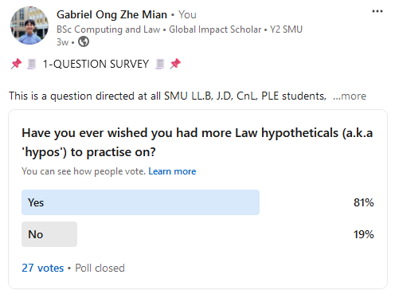
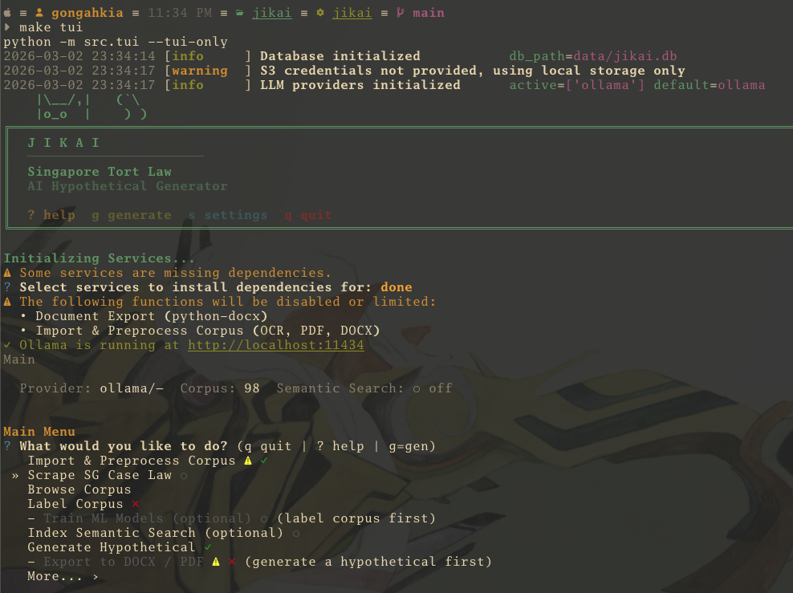
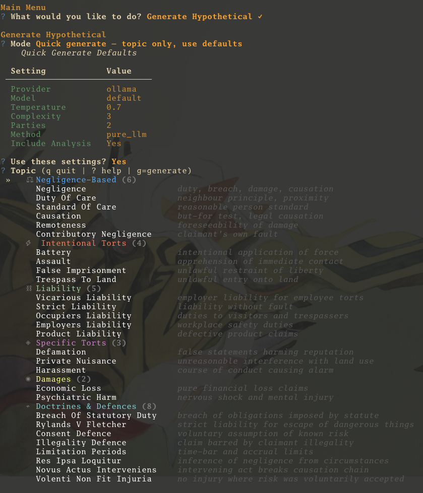
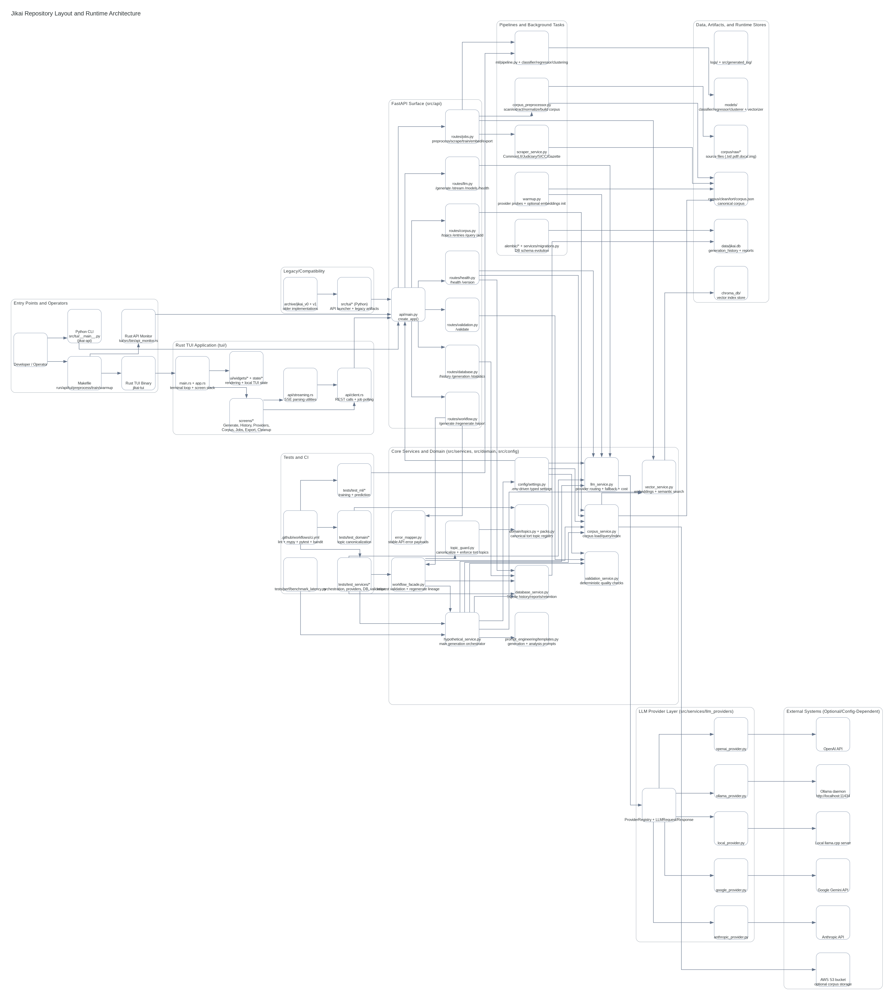

[](https://github.com/gongahkia/jikai/releases/tag/1.0.0)
[](https://github.com/gongahkia/jikai/releases/tag/2.0.0)
[](https://github.com/gongahkia/jikai/releases/tag/3.0.0)


> [!IMPORTANT]
> Please read through [this disclaimer](#disclaimer) before using [Jikai](https://github.com/gongahkia/jikai).

# `Jikai`

[ML](#so-wheres-the-ml-in-this) & [LLM](#so-wheres-the-llm-in-this)-powered [Legal Hypothetical Generator](#architecture) for Singapore [Tort Law](https://www.advlawllc.com/practice/tort-law/#:~:text=Tort%20law%20deals%20with%20civil,defamation%2C%20trespass%2C%20and%20nuisance.).

## Rationale

Over the finals season in December 2024, I found myself wishing I had more tort law [hypotheticals](https://successatmls.com/hypos/) to practise on aside from those [my professor](https://www.linkedin.com/in/jerroldsoh/?originalSubdomain=sg) had provided.

A [quick google search](https://www.reddit.com/r/LawSchool/comments/16istgs/where_to_find_hypos/) revealed this sentiment was shared by many studying law, even [outside of Singapore](https://www.reddit.com/r/findareddit/comments/ssr9wk/a_community_for_hypothetical_legal_questions/). Conducting a [Linkedin poll](https://www.linkedin.com/posts/gabriel-zmong_smu-law-linkedin-activity-7269531363463049217-DXUm?utm_source=share&utm_medium=member_desktop) confirmed these results.

<div align="center">
    <br>
    
    <br><br>
</div>

With these considerations in mind, I created `Jikai`.

`Jikai` generates legal hypotheticals for Singapore Tort Law with a [multi-provider LLM backend](#architecture), [semantic corpus retrieval](#architecture), and an [ML-assisted validation pipeline](#architecture), served through a [Rust TUI](#stack) or [FastAPI REST API](#stack).

## Stack

* *Backend/API*: [Python 3.12+](https://www.python.org/), [FastAPI](https://fastapi.tiangolo.com/), [Uvicorn](https://www.uvicorn.org/), [Pydantic](https://docs.pydantic.dev/), [pydantic-settings](https://docs.pydantic.dev/latest/concepts/pydantic_settings/)
* *TUI*: [Rust](https://www.rust-lang.org/), [ratatui](https://ratatui.rs/), [crossterm](https://docs.rs/crossterm/), [tokio](https://tokio.rs/), [reqwest](https://docs.rs/reqwest/)
* *LLM Provider Layer*: [Ollama](https://ollama.ai/), [OpenAI](https://openai.com/), [Anthropic](https://www.anthropic.com/), [Google Gemini](https://ai.google.dev/), [Local LLM](https://github.com/ggerganov/llama.cpp) via llama.cpp server
* *ML Foundation*: [scikit-learn](https://scikit-learn.org/), [pandas](https://pandas.pydata.org/), [PyTorch](https://pytorch.org/), [Transformers](https://huggingface.co/docs/transformers/)
* *Retrieval/Embeddings*: [Sentence Transformers](https://www.sbert.net/), [ChromaDB](https://www.trychroma.com/)
* *Data/Persistence*: [SQLite](https://www.sqlite.org/) (`data/jikai.db`), JSON corpus (`corpus/clean/tort/corpus.json`), Chroma persistent store (`./chroma_db`)
* *Corpus Ingestion/Export*: [BeautifulSoup4](https://www.crummy.com/software/BeautifulSoup/), [lxml](https://lxml.de/), [httpx](https://www.python-httpx.org/), [PyMuPDF](https://pymupdf.readthedocs.io/), [python-docx](https://python-docx.readthedocs.io/), [Pillow](https://pillow.readthedocs.io/), [pytesseract](https://pypi.org/project/pytesseract/)
* *Observability/Logging*: [structlog](https://www.structlog.org/)
* *Quality Tooling*: [pytest](https://pytest.org/), [pytest-asyncio](https://pytest-asyncio.readthedocs.io/), [pytest-cov](https://pytest-cov.readthedocs.io/), [flake8](https://flake8.pycqa.org/), [mypy](http://mypy-lang.org/), [black](https://black.readthedocs.io/), [isort](https://pycqa.github.io/isort/)

## Screenshots




## Usage

The below instructions are for locally running `Jikai`. Requires [Python 3.12+](https://www.python.org/), [Rust/Cargo](https://www.rust-lang.org/tools/install), and [Ollama](https://ollama.ai/).

1. Create `.env` off of `env.example` and fill your API keys and configuration.

```console
$ make env-setup
```

2. Install dependencies and build the Rust TUI binaries.

```console
$ make dev-setup
```

3. Start local LLM runtime (default provider/model path).

```console
$ ollama serve
$ ollama pull llama2:7b
```

4. Launch `Jikai` using one of the runtime entry points below.

```console
$ make run                                # API + Rust TUI together
$ make api                                # API via Rust API monitor UI
$ python -m src.api --host 127.0.0.1 --port 8000  # API only (plain uvicorn runner)
$ make tui                                # Rust TUI only (requires API already running)
```

5. Run data/model utility jobs as needed.

```console
$ make preprocess # build corpus/clean/tort/corpus.json from corpus/raw/*
$ make train      # train required ML models
$ make warmup     # preload corpus + probe provider health
$ make label      # append labelled examples to corpus/labelled/sample.csv
```

6. Check runtime health and quality gates.

```console
$ make health
$ make health-llm
$ make test
$ make lint
```

Inside the Rust TUI, `Chat` is the default landing screen with command-driven workflows.
Use `/menu` to open the multi-screen navigation, and `/help` to list command families (`hypo`, `regenerate`, `report`, `corpus`, `validation`, `jobs`, `providers`, `history`, `stats`, `settings`, `guided`, `label`).

## So where's the [ML](https://en.wikipedia.org/wiki/Machine_learning) in this?

`Jikai` uses ML as a **required foundation stage** before LLM generation.

* *ML training/inference pipeline*: `src/ml/pipeline.py` orchestrates the classifier (`src/ml/classifier.py`), regressor (`src/ml/regressor.py`), and clusterer (`src/ml/clustering.py`).
* *Generation-time ML foundation*: `src/services/workflow_facade.py` calls `src/services/hypo_generator.py` first (`_prepare_combined_request`), and blocks generation if required ML models are unavailable.
* *Topic and structure heuristics*: `src/ml/topic_selector.py` and `src/ml/structural_planner.py` provide retrieval/planning support to compose realistic fact patterns.
* *Quality scoring signals*: the regressor and confidence values are attached into generation metadata and used in orchestration/feedback context.
* *Corpus and model lifecycle jobs*: `/jobs/train`, `/jobs/label`, and `make train`/`make label` keep ML artifacts and labelled data current (`models/*`, `corpus/labelled/*.csv`).
* *Retrieval ML layer*: `src/services/vector_service.py` uses `sentence-transformers` embeddings + Chroma for semantic search; `src/services/corpus_service.py` falls back to overlap matching if vector search is unavailable.

## So where's the [LLM](https://en.wikipedia.org/wiki/Large_language_model) in this?

The LLM layer is the **second stage** in generation, after ML scaffolding.

* *Provider abstraction/routing*: `src/services/llm_service.py` handles provider initialization, health checks, fallback/circuit-breaker logic, model selection, streaming, and session cost tracking.
* *Provider adapters*: `src/services/llm_providers/` contains implementations for Ollama, OpenAI, Anthropic, Google Gemini, and local llama.cpp-compatible servers.
* *Prompted generation path*: `src/services/hypothetical_service.py` builds prompt context (`src/services/prompt_engineering/templates.py`) and calls `llm_service` to generate the final hypothetical/analysis output.
* *Direct LLM API surface*: `/llm/generate`, `/llm/stream`, `/llm/models`, `/llm/health`, `/llm/select-provider`, `/llm/select-model` in `src/api/routes/llm.py`.
* *LLM-assisted NLU path*: chat intent parsing in `src/services/chat_nlu.py` can optionally use an LLM (`/chat/interpret` endpoint).
* *Config-driven provider enablement*: API keys/hosts in `.env` (`OPENAI_API_KEY`, `ANTHROPIC_API_KEY`, `GOOGLE_API_KEY`, `OLLAMA_HOST`, `LOCAL_LLM_HOST`) decide which providers are active at runtime.

## Architecture



## Model Support

`Jikai` uses a provider registry and initializes providers from environment configuration at startup.

| Provider | Enabled When | Default Model | Model List Source | Streaming | Notes |
|----------|--------------|---------------|-------------------|-----------|-------|
| `ollama` | Always attempted (uses `OLLAMA_HOST`) | `llama2:7b` (or `LLM_MODEL`) | Dynamic from Ollama `/api/tags` | Yes | Default local-first provider path |
| `openai` | `OPENAI_API_KEY` is set | `gpt-4o` | Dynamic from OpenAI `/v1/models` (fallback list on error) | Yes | Supports provider/model selection through `/llm/select-*` |
| `anthropic` | `ANTHROPIC_API_KEY` is set (and SDK available) | `claude-sonnet-4-5-20250929` | Static allow-list in provider module | Yes | Claude adapter supports system prompts |
| `google` | `GOOGLE_API_KEY` is set (and SDK available) | `gemini-2.0-flash` | Static allow-list in provider module | Yes | Gemini adapter supports system prompts |
| `local` | `LOCAL_LLM_HOST` is set | `local` | Dynamic from `/v1/models` on local server (fallback to `local`) | Yes | Intended for llama.cpp/OpenAI-compatible local endpoints |

## API

`Jikai`'s REST API is served at `http://localhost:8000`. Interactive docs are available at `/docs` when `API_DEBUG=true`.

| Method | Endpoint | Description |
|--------|----------|-------------|
| `GET` | `/health` | Health check across all services |
| `GET` | `/version` | Service version info |
| `POST` | `/chat/interpret` | Parse natural language into structured chat command intent |
| `POST` | `/workflow/generate` | Generate a legal hypothetical |
| `POST` | `/workflow/regenerate` | Regenerate from a previous generation |
| `POST` | `/workflow/report` | Submit a quality report for a generation |
| `GET` | `/workflow/reports/{generation_id}` | List reports for a generation |
| `GET` | `/corpus/topics` | List all available tort-law topics |
| `GET` | `/corpus/entries` | Fetch corpus entries (`topic`, `limit` query params supported) |
| `POST` | `/corpus/query` | Query corpus by topics with semantic search |
| `POST` | `/corpus/add` | Add a new entry to the corpus |
| `GET` | `/corpus/health` | Corpus service health check |
| `GET` | `/llm/health` | Check LLM provider health (`provider` query param optional) |
| `GET` | `/llm/models` | List available models per provider (`provider` query param optional) |
| `POST` | `/llm/generate` | Direct LLM generation |
| `POST` | `/llm/stream` | Streaming LLM generation (SSE) |
| `POST` | `/llm/select-provider` | Switch the active LLM provider |
| `POST` | `/llm/select-model` | Switch the active model |
| `GET` | `/llm/session-cost` | Get session token usage and cost |
| `GET` | `/db/history` | Fetch generation history (`limit` query param supported) |
| `GET` | `/db/generation/{generation_id}` | Get a specific generation |
| `GET` | `/db/count` | Get total generation count |
| `GET` | `/db/statistics` | Generation statistics from the SQLite database |
| `GET` | `/db/reports/{generation_id}` | Get reports for a generation |
| `POST` | `/validation/validate` | Validate a hypothetical against required topics |
| `POST` | `/jobs/preprocess` | Preprocess raw corpus files (async job) |
| `POST` | `/jobs/scrape` | Scrape cases from legal databases (async job) |
| `POST` | `/jobs/train` | Train ML pipeline models (async job) |
| `POST` | `/jobs/embed` | Embed corpus into vector store (async job) |
| `POST` | `/jobs/export` | Export a generation artifact (DOCX path by default) |
| `POST` | `/jobs/cleanup` | Clean up data targets (async job) |
| `POST` | `/jobs/label` | Append labelled entries to training corpus CSV |
| `GET` | `/jobs/{job_id}/status` | Poll async job status |
| `POST` | `/jobs/{job_id}/cancel` | Cancel a running job |

## Disclaimer

All hypotheticals generated with [`Jikai`](https://github.com/gongahkia/jikai) are intended for educational and informational purposes only. They do not constitute legal advice and should not be relied upon as such.

### No Liability

By using this tool, you acknowledge and agree that:

1. The creator of this tool shall not be liable for any direct, indirect, incidental, consequential, or special damages arising out of or in connection with the use of the hypotheticals generated, including but not limited to any claims related to defamation or other torts.
2. Any reliance on the information provided by this tool is at your own risk. The creators make no representations or warranties regarding the accuracy, reliability, or completeness of any content generated.
3. The content produced may not reflect current legal standards or interpretations and should not be used as a substitute for professional legal advice.
4. You are encouraged to consult with a qualified legal professional regarding any specific legal questions or concerns you may have. Use of this tool signifies your acceptance of these terms.

## References

The name `Jikai` is in reference to the sorcery of [Ikuto Hagiwara](https://kagurabachi.fandom.com/wiki/Ikuto_Hagiwara) (萩原 幾兎), the commander of the [Kamunabi's](https://kagurabachi.fandom.com/wiki/Kamunabi) [anti-cloud gouger special forces](https://kagurabachi.fandom.com/wiki/Kamunabi#Anti-Cloud_Gouger_Special_Forces), who opposed [Genichi Sojo](https://kagurabachi.fandom.com/wiki/Genichi_Sojo) in the [Vs. Sojo arc](https://kagurabachi.fandom.com/wiki/Vs._Sojo_Arc) of the manga series [Kagurabachi](https://kagurabachi.fandom.com/wiki/Kagurabachi_Wiki).

<div align="center">
  
</div>

## Research

`Jikai` would not be where it is today without existing academia.

* [*Focused and Fun: A How-to Guide for Creating Hypotheticals for Law Students*](https://scribes.org/wp-content/uploads/2022/10/Simon-8.23.21.pdf) by Diana J. Simon
* [*Reactive Hypotheticals in Legal Education: Leveraging AI to Create Interactive Fact Patterns*](https://papers.ssrn.com/sol3/papers.cfm?abstract_id=4763738) by Sean Steward
* [*Legal Theory Lexicon: Hypotheticals*](https://lsolum.typepad.com/legaltheory/2023/01/legal-theory-lexicon-hypotheticals.html) by Legal Theory Blog
* [*The Case Method*](https://jle.aals.org/cgi/viewcontent.cgi?article=1920&context=home) by E.M. Morgan
* [*A Process Model of Legal Argument with Hypotheticals*](https://publications.informatik.hu-berlin.de/archive/cses/publications/a_process_model_of_legal_argument_with_hypotheticals.pdf) by Kevin Ashley, Collin Lynchb, Niels Pinkwartc, Vincent Alevend
* [*The Case Study Teaching Method*](https://casestudies.law.harvard.edu/the-case-study-teaching-method/) by Havard Law School
